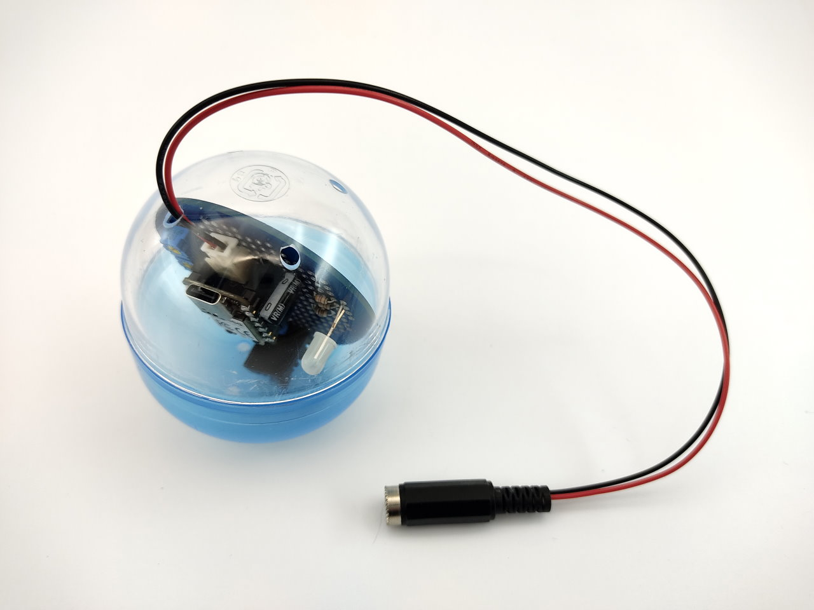

## エレショップblog 電子工作プロジェクト (作例紹介)

[エレショップblog](http://eleshop.blog.jp/) 2022年5月に掲載の記事「【初級者向け】XIAO RP2040で電子工作してみました！」で紹介する作例に関する資料を掲載します。

#### 記事本文 ([エレショップblog](http://eleshop.blog.jp/))

1. [【初級者向け】XIAO RP2040で電子工作してみました！★1](http://eleshop.blog.jp/archives/46407331.html) (2022年5月12日)
1. [【初級者向け】XIAO RP2040で電子工作してみました！★2](http://eleshop.blog.jp/archives/46444637.html) (2022年5月19日)
1. [【初級者向け】XIAO RP2040で電子工作してみました！★3](http://eleshop.blog.jp/archives/46490287.html) (2022年5月26日)

## 利用について

本ページにて公開する資料は全て無保証での提供とさせていただきます。本ページの資料を利用した事による不利益や損害などについて、弊社(共立電子産業)は一切の責任を負いかねます。

また、内容はすべて掲載当時(2022年5月現在)の情報をもとに作成したものとなります。

## 回路図

- [回路図(PNG)](https://github.com/kyohritsu/eleshop-blog-20220512/blob/main/Schematic.png)

## プログラム

[MicroPython](https://micropython.org/download/rp2-pico/) `rp2-pico` v1.18 (2022-01-17) で動作確認

- [main.py](https://github.com/kyohritsu/eleshop-blog-20220512/blob/main/main.py)

## 部品表

### 基本部材

| 品名 | 型番 | 数量 |
| ---- | ---- | ---- |
| [Seeed XIAO RP2040](https://eleshop.jp/shop/g/gM17311/)               | 102010428          |  1 |
| [ヘッダーソケット 8P](https://eleshop.jp/shop/g/gBBT412/) ★7Pに加工  | #2802-08           |  2 |
| [デジタル温湿度センサー](https://eleshop.jp/shop/g/g402750/)          | KP-DHT20           |  1 |
| [φ5mm マルチカラーLED](https://eleshop.jp/shop/g/g8C2313/)           | RT5-5818RGBW-B     |  1 |
| [小型カーボン抵抗 1/4W 5% 470Ω](https://eleshop.jp/shop/g/gB5Q36P/)  | 470ohm             |  2 |
| [小型カーボン抵抗 1/4W 5% 1kΩ](https://eleshop.jp/shop/g/gB5R363/)   | 1kohm              |  1 |
| [小型カーボン抵抗 1/4W 5% 10kΩ](https://eleshop.jp/shop/g/gB5R36R/)  | 10kohm             |  2 |
| [半固定抵抗 10kΩ](https://eleshop.jp/shop/g/g4B8138/)                | GF063P1 B10kΩ     |  2 |
| [積層セラミックコンデンサ 0.1μF](https://eleshop.jp/shop/g/gI2M314/) | RDER71H104K0K1H03B |  1 |
| [電解コンデンサ 16V 10μF](https://eleshop.jp/shop/g/gF6J311/)        | UVR1C100MDD        |  1 |

### 記事で使用したブレッドボード

| 品名 | 型番 | 数量 |
| ---- | ---- | ---- |
| [ブレッドボード](https://eleshop.jp/shop/g/g916312/)                       | AD-100(N) |  1 |
| [ブレッドボード用ジャンプワイヤセット](https://eleshop.jp/shop/g/gL35121/) | BBJ-65    |  1 |

### 基板製作・配線材

| 品名 | 型番 | 数量 |
| ---- | ---- | ---- |
| カプセル型ユニバーサル基板 ★[店舗ガチャガチャで販売中!!](http://eleshop.blog.jp/archives/46490287.html) |                     |  1 |
| [ジュンフロンETFE電線0.51mm 10m 青](https://eleshop.jp/shop/g/gDAC13A/)                                  | ETFE0.51mm L-10m BL |  1 |
| [ゼロ固定抵抗器Z (小型0Ωジャンパー)](https://eleshop.jp/shop/g/gE77364/)                                | Z16CS               |  1 |

### 電源ケーブル製作

| 品名 | 型番 | 数量 |
| ---- | ---- | ---- |
| [DCジャック中継型φ2.1](https://eleshop.jp/shop/g/gM3B31A/)              | DCJ-CMJ077      |  1 |
| [耐熱絶縁ビニル電線](https://eleshop.jp/shop/g/gC3O13Q/) ★赤黒のみ使用  | UL1007AWG26 2x6 |  1 |
| [XHコネクタ 基板用ポスト サイド型2P](https://eleshop.jp/shop/g/g61A14Y/) | S2B-XH-A        |  1 |
| [XHコネクタ ハウジング 2P](https://eleshop.jp/shop/g/g61A144/)           | XHP-2           |  1 |
| [XHコネクタ コンタクトピン](https://eleshop.jp/shop/g/g65E314/)          | BXH-001T-P0.6   |  2 |
